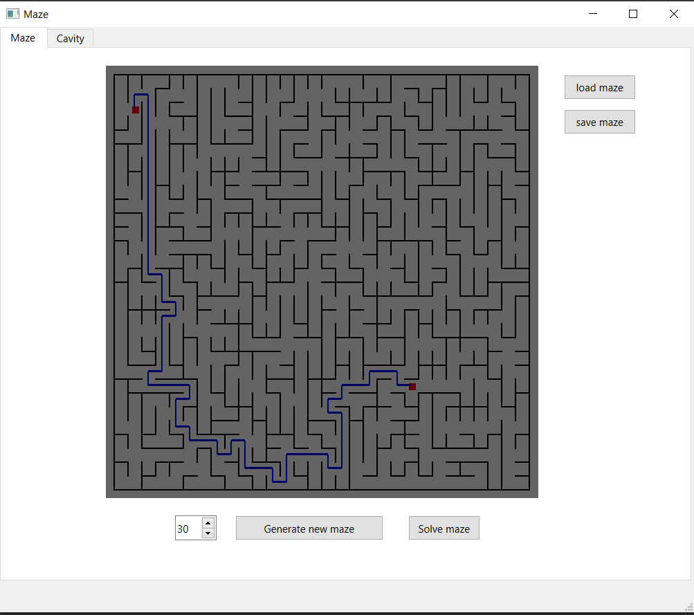
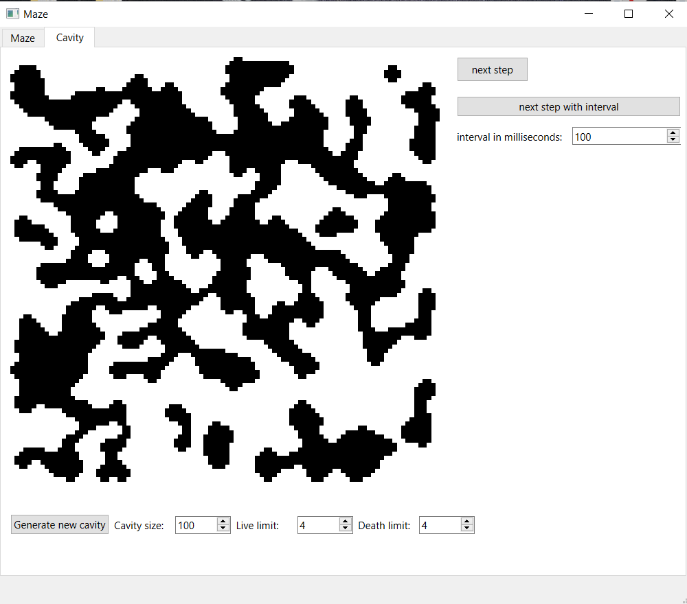

# Maze
QT application for automatic perfect maze and cavity generation.
## Build instructions
Project requires QT libraries installed.
### Linux/Mac
1. move to the build directory
2. run "cmake -S ../ -B ."
3. run "make build"
### Windows
1. move to the build directory
2. run "cmake -S ../ -B ."
3. run "cmake --build . --config Release"
## Maze generation

- "Generate maze" button will create perfect maze of specified size. A maze is considered perfect if it is possible to get from each point to any other point in exactly one way. Eller's algorithm is used for maze generation.
- You can store/load generated maze to/from a file by clicking "save maze"/"load maze" button.
- You can find shortest path on maze between any 2 given points by clicking "solve maze" button. To specify points, just click on the maze where you want point to be. Second click on the same spot will delete point.
## Cavity generation

- "Generate cavity" button will create randomly colored black and white "cavity" of specified size.
- "Next step" button will do following:
  1. Every alive cell with less living cells around it than "Death limit" will die.
  2. Every dead cell with more linving cells around it than "Live limit" will get alive.
- "next spet with interval" button will apply "next step" operation periodically untill static state will be reached.
